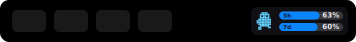
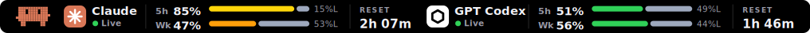
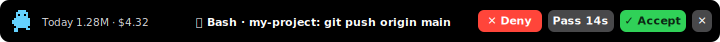
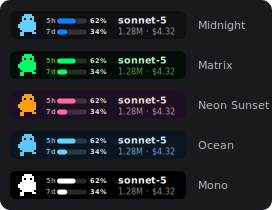
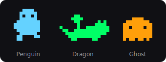

<div align="center">

# 🐧 Touch Bar Token Usage

**Your Claude Code usage, living on the MacBook Pro Touch Bar** —
5-hour & weekly limit bars, the active model, and one-tap **Accept / Deny** for permission prompts.
With a pixel pet that runs faster while your tokens burn. 🔥

[](https://github.com/qazwsx-maker/Touch-Bar-Token-Usage/releases/latest/download/TouchBarTokenUsage.zip)
[](https://github.com/qazwsx-maker/Touch-Bar-Token-Usage/actions)
[](#requirements)
[](LICENSE)
[](https://qazwsx-maker.github.io/Touch-Bar-Token-Usage/)

<br>



*The compact widget — pet + 5-hour & weekly limit bars, sized to fit the Control Strip*



*Tap it → full-width bars (or a stats text line — your choice)*


*…or ignite ⚔️ lightsaber mode: glowing beams that flicker and pulse with your burn rate*



*Claude asks for permission → decide right on the Touch Bar*

</div>

---

## ✨ Features

- 📊 **Limit bars** — live `5h` (Claude's 5-hour session block, with reset time) and `7d` (rolling week) progress bars, percent inside. Bars turn orange at 75 % and red at 90 %. Tap the widget for **full-width bars** across the whole Touch Bar (selectable layout).
- ⚔️ **Lightsaber mode** — optionally render the bars as glowing animated energy beams (white-hot core, flicker, traveling pulses). Set to *Auto* and the sabers ignite only while you're burning tokens hard.
- 🤖 **Active model** — the expanded bar and menu show whether you're burning `sonnet-5` or `opus-4-5` money.
- ✅ **Accept / Deny from the Touch Bar** — a native [Claude Code hook](https://code.claude.com/docs/en/hooks) forwards permission prompts to the bar. Tap **✓ Accept**, **✕ Deny**, or **Pass** to fall back to the terminal. No keyboard injection, no focus stealing.
- 🐧 **Pixel pets** — penguin, dragon, or ghost. Idle when you're idle, sprinting when tokens flow.
- 🎨 **Themes** — five presets + fully custom colors, with a live preview right in Preferences (works on Macs without a Touch Bar too).
- 📈 **Menu bar companion** — your pet as the icon, live `63%/60%` (5h / weekly) next to it, plus today & month totals, cost, burn rate and block reset time in its menu.
- 🔔 Extras — sound on new requests, "Claude finished" toasts, an optional on-screen approval panel, launch at login.
- 🔒 **100 % local** — reads `~/.claude/projects/**/*.jsonl` only. Nothing ever leaves your Mac.

<div align="center">

&nbsp;&nbsp;

</div>

## 📦 Install

**[⬇ Download the latest version](https://github.com/qazwsx-maker/Touch-Bar-Token-Usage/releases/latest/download/TouchBarTokenUsage.zip)** — universal binary (Apple Silicon + Intel), ~600 KB.

Or paste this in Terminal:

```bash
curl -L -o /tmp/tbtu.zip https://github.com/qazwsx-maker/Touch-Bar-Token-Usage/releases/latest/download/TouchBarTokenUsage.zip \
  && ditto -x -k /tmp/tbtu.zip /Applications \
  && xattr -cr /Applications/TouchBarTokenUsage.app \
  && open /Applications/TouchBarTokenUsage.app
```

> The `xattr -cr` step is needed because the app is ad-hoc signed, not notarized (see [FAQ](#-faq)).
> Installing manually? Unzip → drag to `/Applications` → right-click → Open.

### Requirements

MacBook Pro with a Touch Bar (2016 – 2020, incl. M1/M2 13″) · macOS 12 Monterey or newer.
No Touch Bar? The menu bar, on-screen approval panel and preview still work.

### Build from source

```bash
git clone https://github.com/qazwsx-maker/Touch-Bar-Token-Usage.git
cd Touch-Bar-Token-Usage
make install          # needs Xcode Command Line Tools
```

## 🚀 Set up Claude approvals (2 clicks)

1. Launch the app → Preferences opens on first run (menu bar 🤖 → *Preferences…* later).
2. **Setup** tab → **Install Claude Code hook** → **Send test approval request** — the Accept/Deny bar should light up.
3. Start a **new** Claude Code session. Done.

**How it works:** for matching tools (default `Bash|Edit|Write|MultiEdit|NotebookEdit|WebFetch`) the hook holds the tool call and asks this app first. You get up to *N* seconds (default 20, configurable) to tap:

| Tap | Result |
|---|---|
| ✓ **Accept** | Tool runs immediately (`permissionDecision: allow`) |
| ✕ **Deny** | Claude is told "Denied from Touch Bar" |
| **Pass** / timeout | Falls through to the normal terminal prompt |
| *(app not running)* | Hook exits silently — zero interference |

Requests are authenticated with a private token (`~/.claude/touchbar-usage/token`, mode 600) and the server binds to `127.0.0.1` only.

## 📐 How the limit bars work

- **5h** — Claude-style session blocks (ccusage semantics): a block starts with your first message (floored to the hour), lasts 5 hours; a ≥ 5 h gap starts a new one. Reset time shows in the menu and the full bar.
- **7d** — rolling 7-day sum.
- **Limits** — set exact token budgets in *Preferences → General → Usage limits*, or leave **auto**: the bar compares against the highest usage ever recorded on your machine (expect it to look full the very first session — it calms down once you have history).
- **Counted tokens:** input + output + cache writes. Cache reads are excluded so they don't swamp the bars. It's a local estimate — the app can't read your real server-side quota, so for accuracy grab your ceiling from `/usage` in Claude Code and type it in.

## ⚙️ Configuration

Everything lives in Preferences (menu bar 🤖 → `⌘,`):

| Tab | What you tune |
|---|---|
| **Setup** | Status lights, hook install, test request, live Touch Bar preview |
| **Appearance** | Theme (5 presets + custom colors), bar style (classic / lightsaber / auto), pet, animation energy |
| **Approvals** | Enable/disable, decision timeout, tool regex, auto-pass Bash prefixes, port, sounds, on-screen panel |
| **General** | Compact bars on/off, tap-to-expand layout (big bars / stats text), reset display (time left ↻1:42 / clock ↻14:30), custom token limits, text-mode metric & model, menu bar %, launch at login |

## 🧯 FAQ

<details><summary><b>Why the <code>xattr -cr</code> dance?</b></summary>

The app is signed ad-hoc, not notarized with Apple ($99/yr). Clearing the quarantine flag (or right-click → Open) is a one-time step. All code is open here if you'd rather audit and `make install` yourself.
</details>

<details><summary><b>I launched the app and… nothing happened</b></summary>

The app has no Dock icon — it lives in the **menu bar**: look for your pet (🐧 by default) at the top-right of the screen. Since v0.2.1, double-clicking the app again always brings up the Preferences window, and the window opens automatically the first time you run a new version. Also note that every freshly downloaded zip is quarantined again — re-run `xattr -cr /Applications/TouchBarTokenUsage.app` after each manual update.
</details>

<details><summary><b>The widget doesn't show up</b></summary>

Touch Bar hardware required. Don't run Pock/MTMR at the same time — they use the same private `DFRFoundation` Control Strip API. Try quitting and reopening the app.
</details>

<details><summary><b>Claude doesn't ask on the Touch Bar</b></summary>

Hooks load at session start — open a **new** Claude Code session after installing the hook. Check the app is running and the *Setup* tab shows the server listening. Tools auto-allowed by your permission rules still trigger the Touch Bar prompt; use *Auto-pass Bash prefixes* or tighten the tool regex if it's noisy.
</details>

<details><summary><b>Numbers show 0</b></summary>

The app reads `~/.claude/projects` on the Mac it runs on — use Claude Code there at least once. History older than ~35 days is skipped.
</details>

<details><summary><b>Uninstall</b></summary>

Preferences → Approvals → **Remove Hook**, quit the app, delete `/Applications/TouchBarTokenUsage.app` and `~/.claude/touchbar-usage`.
</details>

## 🛠 Development

```bash
swift test    # core logic tests (parser, pricing, session blocks, hook merger) — runs on Linux too
make zip      # universal build → dist/TouchBarTokenUsage.zip (macOS)
```

CI builds every push and attaches the app zip as an artifact; tags `v*` (or *Actions → Build → Run workflow* with a tag) publish a Release. UI mockups in `docs/img` are generated from the real sprite/layout data.

---

## 🇹🇭 สำหรับคนไทย

แอปแสดงการใช้ token ของ Claude Code บน Touch Bar: **bar 5 ชั่วโมง / 7 วันเทียบ limit**, **model ที่ใช้อยู่**, และกด **Accept / Deny** คำขอสิทธิ์ของ Claude จาก Touch Bar ได้เลย พร้อม pet พิกเซล (เพนกวิน/มังกร/ผี) ที่วิ่งเร็วตามความแรงของการเผา token และ theme สีปรับได้เต็มที่

**ติดตั้ง:** [⬇ โหลดเวอร์ชันล่าสุดที่นี่](https://github.com/qazwsx-maker/Touch-Bar-Token-Usage/releases/latest/download/TouchBarTokenUsage.zip) → แตก zip ลากไป `/Applications` → รัน `xattr -cr /Applications/TouchBarTokenUsage.app` (แอปยังไม่ notarize) → เปิดแอป → แท็บ Setup กด **Install Claude Code hook** แล้วกด **Send test approval request** → เปิด session ใหม่ของ Claude Code

- กด ✓ Accept = อนุญาตทันที · ✕ Deny = ปฏิเสธ · Pass/หมดเวลา = กลับไปถามใน terminal ตามปกติ (แอปปิดอยู่ = ไม่มีผลอะไรเลย)
- ค่า limit ตั้งเองได้ที่ Preferences → General (แนะนำดูเพดานจริงจาก `/usage` ใน Claude Code) หรือปล่อย auto ให้เทียบกับสถิติสูงสุดของตัวเอง
- ทุกอย่างประมวลผลในเครื่อง ไม่ส่งข้อมูลออกไปไหน

## License

[MIT](LICENSE) © qazwsx-maker
